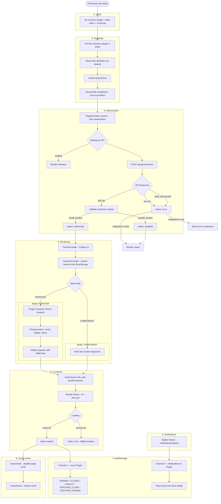

# Fluxo de Injeção no Site Terceiro



---

## Resumo do fluxo em texto

| Etapa | O que acontece |
|---|---|
| **1. HTML** | Site terceiro inclui a `<div>` e o `<script>` |
| **2. Bootstrap** | Script lê `data-*`, monta providers React |
| **3. Autorização** | `POST /plugin/authorize` com token + origem + horário |
| **4. Validação** | API verifica CORS, token, domínio registrado |
| **5. Agendamento** | Plugin verifica se está dentro da janela de horário |
| **6. Renderização** | Monta botão (POPOVER) ou embed direto (COMPONENT) |
| **7. Iframe** | Constrói URL com parâmetros codificados em base64, renderiza Lia |
| **8. postMessage** | Dois canais independentes: Lia e notificações |
| **9. Sessão** | SessionId persistido no `localStorage` do site hospedeiro |
| **10. Scroll** | Scroll do site bloqueado enquanto cursor está sobre o iframe |

---

## Validações de segurança

```
Site terceiro
    │
    │  POST /plugin/authorize
    │  x-origin: window.location.href
    ▼
API Conversu
    ├─ Verifica política CORS (domínio registrado no painel)
    ├─ Valida token contra domínio de origem
    └─ Retorna 403 se domínio não registrado

Plugin (client-side)
    ├─ Canal 1: aceita postMessage apenas se event.origin === liaEndpoint
    └─ Canal 2: aceita postMessage apenas se notification.startsWith(event.origin)
```
